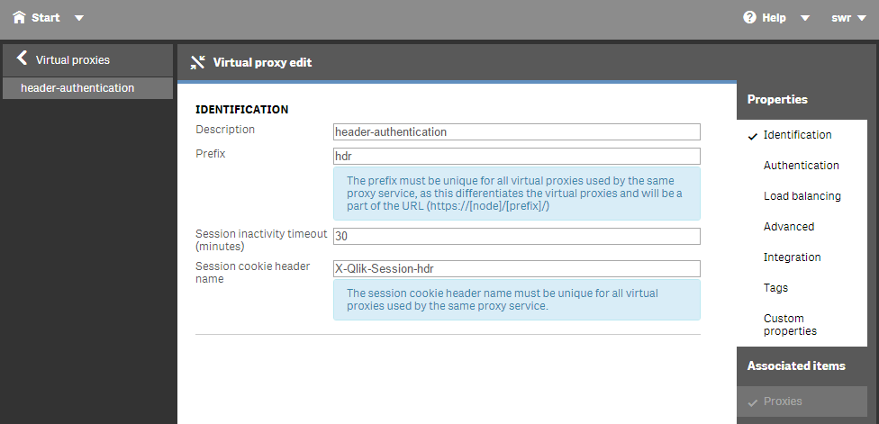
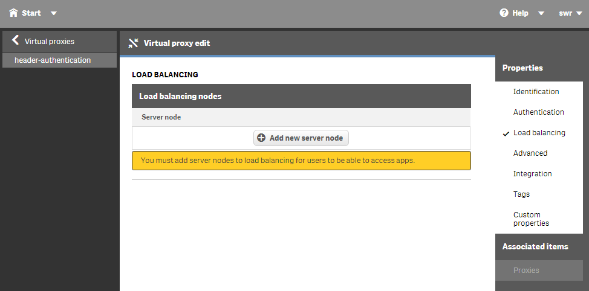
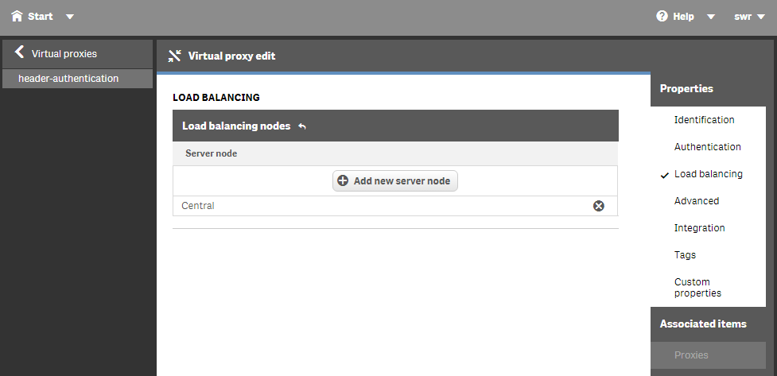
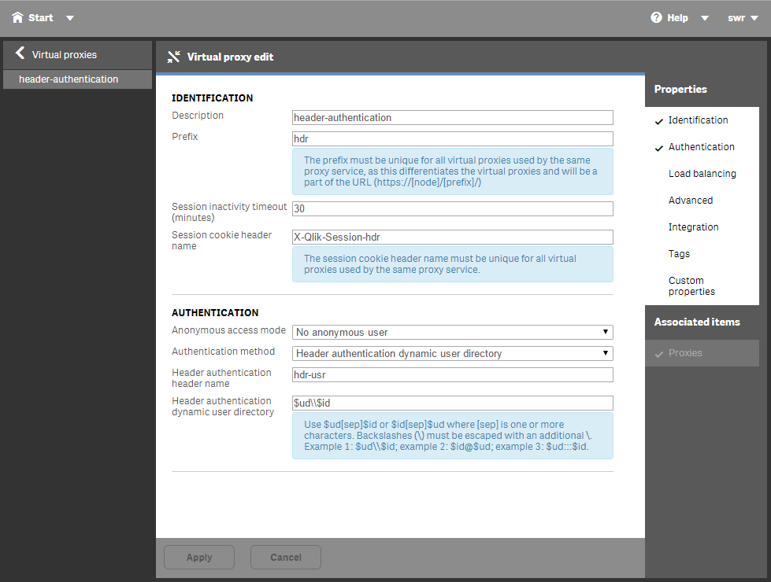

Header authentication is an authentication method in the Qlik Sense environment which can be quite easily set up and therefore ideal for either a development environment or between trusted systems, but should definitely be used with caution.

<!-- toc -->

## Header Authentication & Qlik Sense
With the introduction of the concept of "Virtual Proxies" in Qlik Sense you can easily set up multiple authentication methods for a single environment.

In case of "Header authentication" traditional authentication will be bypassed and passed parameters in the Http-header will be used to identify the current authorized user. Therefore this method is ideal to be used between trusted system where an existing identity mangement system has already identified the given user as an authorized user to access Qlik Sense.

Be aware that header authentication can also be used as a backdoor into your system and should therefore only be used under the following circumstances:

- Between systems which can fully trust each other.
- In combination with a firewall / proxy / routing solution.
- In a development environment, because it's just very easy to set up and configure.

## Instructions
*(This step-by-step guide is using Qlik Sense 2.1.1)*

### Setting up the Virtual Proxy

* Launch the Qlik Mangement Console
* Go to **Virtual Proxies**
* Click on "Create new"

## Identification:
* **Description:** Use any description, not really important, just used in the QMC.
* **Prefix:** Define a prefix which then needs to be used to point the the appropriate Virtual Proxy, for example: Use `hdr` (stands for header), then you need to use `http[s]://%servername%/hdr` to be routed to the virtual proxy "header-authentication"
* **Session inactivity timeout:** By default 30 (minutes). (=> [explanation in the official documentation](http://help.qlik.com/en-US/sense/2.1/Subsystems/ManagementConsole/Content/virtual-proxies-properties.htm))
* **Session cookie header name:** This is a common trap you can fall into. The session cookie name has to be unique. When creating a new virtual proxy the default name is suggested, add for example the value of the **prefix** to the default name to ensure that the session cookie name is unique.

### Authentication:

* **Anonymous access mode:** Define whether anonymous users are allowed or not; set this to "No anymous user"
* **Authentication mode:** Choose one of the authentication methods. In our example it is "Header authentication dynamic user directory" because we'd like to pass in the authenticated user.
* **Header authentication header name:** Define the name of the HTTP header that identifies the user. In our example this is `hdr-usr`.
* **Header authentication dynamic user directory:** Probably the most tricky configuration. This actually tells Qlik Sense how to map the user you have passed in the HTTP header to the Qlik Sense user directory. In the current example we want to use a very generic approach, so we want to allow to define the user-directory (`$ud`) and the user-id (`$id`) to be defined in the HTTP header.

**More information** how to use the configuration options: [Qlik Sense for Developer: Virtual proxies properties](http://help.qlik.com/en-US/sense/2.1/Subsystems/ManagementConsole/Content/virtual-proxies-properties.htm)

### Load balancing:
This setting is only applicable for Qlik Sense 1.1 and higher. A server node needs to be added as a Load balancing node to instruct the virtual proxy to use a specific proxy to route requests.

* Select **Add new server node** and select the node you'd like to add.

### The final result:

## Testing the Virtual Proxy with Postman
Now let's test the virtual proxy we have set up using *[Postman](https://www.getpostman.com/)* and the *[QRS API](http://help.qlik.com/en-us/sense-developer/2.1/Subsystems/ProxyServiceAPI/Content/ProxyServiceAPI/ProxyServiceAPI-Introduction.htm)*.

[Postman](https://www.getpostman.com/) is a Chrome plugin which can be used to call REST APIs. In our case we will test to perform API calls against the QRS API (Qlik Sense Repository API) using the above defined Virtual Proxy.

* Url: First define an endpoint we'd like to call: `about`, so by using the previously defined virtualy proxy `hdr` the URL to call the endpoint `about` would be http[s]://servername/hdr/qrs/about/
* Then let's add a xrfkey to both the URL and the Http header:
	* Url: `http[s]://servername/hdr/qrs/about/?xrfkey:123456789ABCDEFG`
	* Header: `X-Qlik-xrfkey=123456789ABCDEFG`  
*(The purpose of the xrfkey is to eliminate cross-site scripting issues)*
* Finally let's pass in the user we'd like to use as defined in "Header authentication dynamic user directory": `hdr-usr=QSSINGLE/swr` (`QSSINGLE` is the user directory, `swr` is the desired user name)

## References

* [Qlik Sense 1.1: Set Up Header Auth Virtual Proxy](https://community.qlik.com/docs/DOC-8135), article by [Jeffrey Goldberg](https://community.qlik.com/people/jog) on Qlik Community
* [Authentication with HTTP headers](http://help.qlik.com/en-us/sense-developer/2.1/Subsystems/RepositoryServiceAPI/Content/RepositoryServiceAPI/RepositoryServiceAPI-Connect-API-Authenticate-Reqs-Http-Headers.htm), article on Qlik Sense for Developers (2.1.1)
* [Using Xrfkey headers](https://help.qlik.com/en-US/sense-developer/2.1/Subsystems/RepositoryServiceAPI/Content/RepositoryServiceAPI/RepositoryServiceAPI-Connect-API-Using-Xrfkey-Headers.htm), article on Qlik Sense for Developers (2.1.1)
